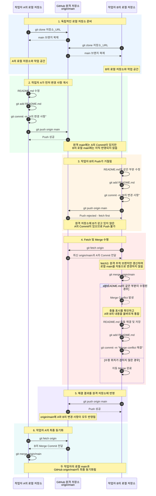

# example

added by visual code / added by Github web


change by vs code 1

change by vs code 2


-------------------------

# Git 협업 실습: Fetch, Merge 및 충돌 해결

작업자 A와 작업자 B가 하나의 GitHub 원격 저장소를 각자의 로컬 저장소로 복제한 뒤, 같은 파일을 수정하면서 발생하는 Push 거절과 Merge Conflict를 해결하는 과정을 나타낸다.

## 전체 시퀀스 다이어그램



## 핵심 정리

- 작업자 A와 B의 로컬 저장소는 서로 독립적이다.
- 다른 작업자가 Push한 내용은 내 로컬 저장소에 자동으로 반영되지 않는다.
- `git fetch origin`은 원격 변경 사항을 가져와 `origin/main`을 갱신한다.
- `git merge origin/main`은 가져온 변경 사항을 현재 로컬 브랜치에 병합한다.
- 같은 파일의 같은 부분을 수정하면 Merge Conflict가 발생할 수 있다.
- 충돌을 직접 수정한 뒤 `add`, `commit`, `push` 순서로 해결 결과를 게시한다.

## 충돌 해결 명령어 요약

```bash
git fetch origin
git merge origin/main

# README.md의 충돌 부분을 직접 수정한 뒤 실행
git add README.md
git commit -m "Merge conflict 해결"
git push origin main
```
