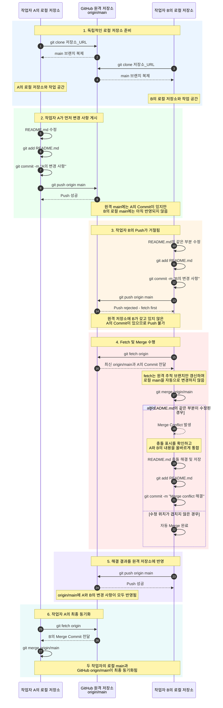

# [Encore]AI Orchestration lab

<details>
<summary>2026-git-start</summary>

-------------------------

# Git 협업 실습: Fetch, Merge 및 충돌 해결

작업자 A와 작업자 B가 하나의 GitHub 원격 저장소를 각자의 로컬 저장소로 복제한 뒤, 같은 파일을 수정하면서 발생하는 Push 거절과 Merge Conflict를 해결하는 과정을 나타낸다.

## 전체 시퀀스 다이어그램



## 핵심 정리

- 작업자 A와 B의 로컬 저장소는 서로 독립적이다.
- 다른 작업자가 Push한 내용은 내 로컬 저장소에 자동으로 반영되지 않는다.
- `git fetch origin`은 원격 변경 사항을 가져와 `origin/main`을 갱신한다.
- `git merge origin/main`은 가져온 변경 사항을 현재 로컬 브랜치에 병합한다.
- 같은 파일의 같은 부분을 수정하면 Merge Conflict가 발생할 수 있다.
- 충돌을 직접 수정한 뒤 `add`, `commit`, `push` 순서로 해결 결과를 게시한다.

## 충돌 해결 명령어 요약

```bash
git fetch origin
git merge origin/main

# README.md의 충돌 부분을 직접 수정한 뒤 실행
git add README.md
git commit -m "Merge conflict 해결"
git push origin main
```

</details>


<details>
<summary>2026_aio2_python-basic</summary>

# 🐍 Python Basic

A repository for learning Python fundamentals, from basic syntax to object-oriented programming.

## 📚 Topics

- Python Basics
- Functions
- Modules & Packages
- Object-Oriented Programming (OOP)
- Exception Handling
- Collections

## 🛠 Tech Stack

- Python 3.13+
- VS Code
- Jupyter Notebook
- Git & GitHub
- pip
- Ruff https://pypi.org/project/ruff/

## 🎯 Goal

- Understand Python fundamentals
- Write clean and Pythonic code
- Build a strong foundation in object-oriented programming
- Develop practical coding skills through hands-on practice

</details>

<details>
<summary>2026_aio2_fastapi</summary>

  # 📚 FastAPI Basic

FastAPI와 Pydantic을 활용하여 **도서 관리 API**를 구현하는 학습 프로젝트입니다.

도서 조회, 검색, 등록 기능을 구현하며 REST API의 기본 개념을 익히고, 정적 HTML 페이지를 통해 API를 직접 테스트할 수 있습니다.

---

## 🚀 Features

- 도서 목록 조회
- 도서 상세 조회
- 제목 검색
- 저자별 필터 및 연도 정렬
- 페이지네이션
- 도서 등록
- Swagger / ReDoc API 문서 제공

---

## 🛠 Tech Stack

- Python 3.10+
- FastAPI
- Pydantic
- Uvicorn

---

## ▶️ Getting Started

```powershell
python -m venv .venv
.\.venv\Scripts\Activate.ps1

pip install fastapi "uvicorn[standard]"

uvicorn main:app --reload
```

서버 실행 후 아래 주소에서 확인할 수 있습니다.

| 페이지 | 주소 |
| ------ | ---- |
| Practice | http://127.0.0.1:8000/static/index.html |
| Swagger UI | http://127.0.0.1:8000/docs |
| ReDoc | http://127.0.0.1:8000/redoc |

---

## 📌 API Endpoints

| Method | Endpoint | Description |
| ------ | -------- | ----------- |
| GET | `/health` | 서버 상태 확인 |
| GET | `/info` | API 정보 조회 |
| GET | `/books` | 도서 목록 조회 |
| GET | `/books/{book_id}` | 도서 상세 조회 |
| GET | `/books/search?keyword=...` | 제목 검색 |
| GET | `/books/filter?author=...&sort=year` | 저자 필터 및 정렬 |
| GET | `/books/page?skip=0&limit=2` | 페이지 조회 |
| POST | `/books` | 도서 등록 |

---

## 📝 Sample Request

```json
{
  "title": "FastAPI 시작하기",
  "author": "홍길동",
  "year": 2026,
  "tags": [
    "Python",
    "API"
  ],
  "publisher": {
    "name": "예제 출판사",
    "city": "Seoul"
  }
}
```

> **Note**
>
> 현재 데이터는 메모리(In-Memory)에 저장되므로 서버를 재시작하면 초기화됩니다.

---

## 📂 Project Structure

```text
.
├── main.py              # FastAPI 애플리케이션 및 API
├── hello.py             # FastAPI 기본 예제
├── test.ipynb           # 학습용 노트북
└── static/
    └── index.html       # API 테스트 페이지
```

---

## 🎯 Learning Goals

- FastAPI 기본 사용법 이해
- Pydantic을 이용한 데이터 검증
- REST API 설계 및 구현
- Query Parameter와 Path Parameter 활용
- Swagger/OpenAPI 문서 활용

</details>


<details>
<summary>Coming soon</summary>

</details>

